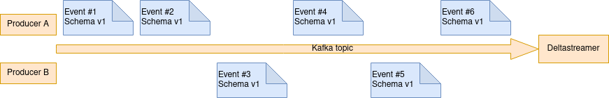
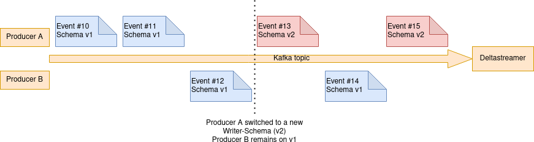
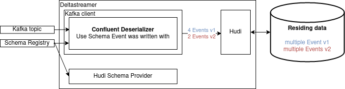
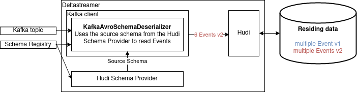

The schema used for data exchange between services can change change rapidly with new business requirements.
Apache Hudi is often used in combination with kafka as a Event Stream where all events are transmitted according to an Record Schema. In our case a Confluent Schema Registry is used to maintain the Schemas and the different Version every Schemas can evolve.

# What do we want to achieve?
We have multiple instances of Deltastreamer running consuming many topics with different schemas.
Ideally every Topic should be able to evolve the schema to match new business requirements. Consumers start producing data with a new schema version and the Deltastreamer picks up the new schema and ingests the data with the new schema. For this to work we run our Deltastreamer instances with the latest schema version available from the Schema Registry to ensure that we always use the freshest schema with all attributes.
A prerequisites it that all the mentioned Schema evolutions must be `BACKWARD_TRANSITIVE` compatible (see [Schema Evolution and Compatibility of Avro Schema changes](https://docs.confluent.io/platform/current/schema-registry/avro.html). This ensures that every record in the kafka topic can always be read using the latest schema.

# What is the problem?
The normal operation looks like this. Multiple (or a single) producers write records to the kafka topic.

Things get complicated when a producer switches to a new Writer-Schema v2 (in this case `Producer A`). `Producer B` remains on Schema v1. E.g. a attribute `myattribute` was added to the schema, resulting in schema version v2.
So Deltastreamer must not only be able to handle Events that suddenly have a new Schema but also parallel operation of different Schema versions.

The default deserializer used by Hudi `io.confluent.kafka.serializers.KafkaAvroDeserializer` uses the schema that that exact record was written with for deserialization. This causes Hudi to get records with multiple different schema from the kafka client. E.g. Event #13 has the new attribute `myattribute`, Event #14 dont has the new attribute `myattribute`. This makes things complicated and error-prone for Hudi.

# Solution
We can use a custom Deserializer `KafkaAvroSchemaDeserializer` and plug it into the kafka client.
As first step the Deserializer gets the source schema from the Hudi SchemaProvider. The SchemaProvider can get the schema for example from a Confluent Schema-Registry or a file.
The Deserializer then reads the records from the topic with the schema the record was written. As next step it will convert all the records to the source schema from the SchemaProvider, in our case the latest schema. As a result, the kafka client will return all records with a unified schema. Hudi does not need to handle different schemas inside a single batch.

# Deletion of attributes
As noted in the FAQ Entry [Caused by: org.apache.parquet.io.InvalidRecordException: Parquet/Avro schema mismatch: Avro field 'col1' not found](https://cwiki.apache.org/confluence/display/HUDI/Troubleshooting+Guide#TroubleshootingGuide-1.1Causedby:org.apache.parquet.io.InvalidRecordException:Parquet/Avroschemamismatch:Avrofield'col1'notfound) deletion of attributes is not an easy thing.
in case wondering, deleting an optional attribute in an schema is a valid schema evolution for avro (see [Schema Evolution and Compatibility of Avro Schema changes](https://docs.confluent.io/platform/current/schema-registry/avro.html).
It is currently not supported in Hudi but in the linked FAQ a way is described to fix this problem.
