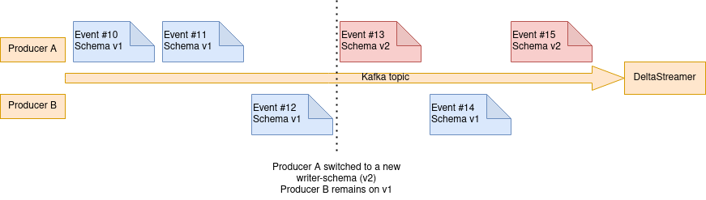

The schema used for data exchange between services can change change rapidly with new business requirements.
Apache Hudi is often used in combination with kafka as a Event Stream where all events are transmitted according to an Record Schema. In our case a Confluent Schema Registry is used to maintain the Schemas and the different Version every Schemas can evolve.

# What do we want to achieve?
We have multiple instances of Deltastreamer running consuming many topics with different schemas.
Ideally every Topic should be able to evolve the schema to match new business requirements. Consumers start producing data with a new schema version and the Deltastreamer picks up the new schema and ingests the data with the new schema. For this to work we run our Deltastreamer instances with the latest schema version available from the Schema Registry to ensure that we always use the freshest schema with all attributes.
A prerequisites it that all the mentioned Schema evolutions must be `BACKWARD_TRANSITIVE` compatible (see [Schema Evolution and Compatibility of Avro Schema changes](https://docs.confluent.io/platform/current/schema-registry/avro.html). This ensures that every record in the kafka topic can always be read using the latest schema.

# What is the problem?
The normal operation looks like this. Multiple (or a single) producers write records to the kafka topic.

Things get complicated when a producer switches to a new Writer-Schema v2 (in this case `Producer A`). `Producer B` remains on Schema v1.For example a attribute ``

On more complex setups topics can have multiple producers. These producers may use different schema version when writing the data.
So Deltastreamer must not only be able to handle Events that suddenly have a new Schema but also parallel operation of different Schema versions.

# Deletion of attributes
TODO: Not that easy. Say something about Uber-Schema. See FAQ Entry [Caused by: org.apache.parquet.io.InvalidRecordException: Parquet/Avro schema mismatch: Avro field 'col1' not found](https://cwiki.apache.org/confluence/display/HUDI/Troubleshooting+Guide#TroubleshootingGuide-1.1Causedby:org.apache.parquet.io.InvalidRecordException:Parquet/Avroschemamismatch:Avrofield'col1'notfound)
